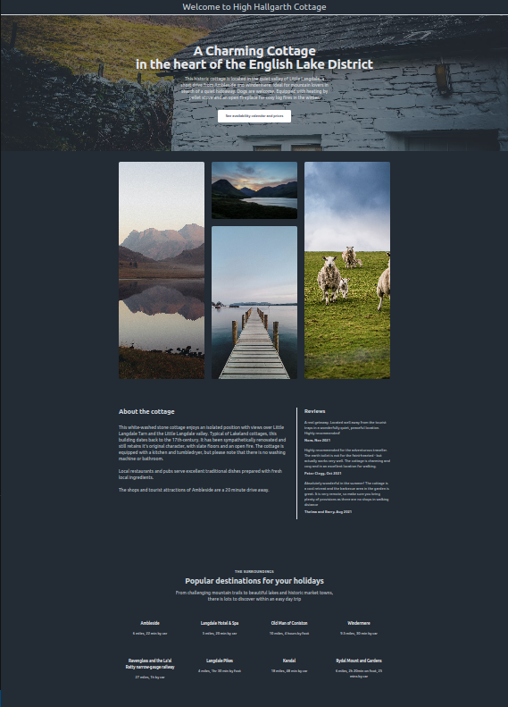
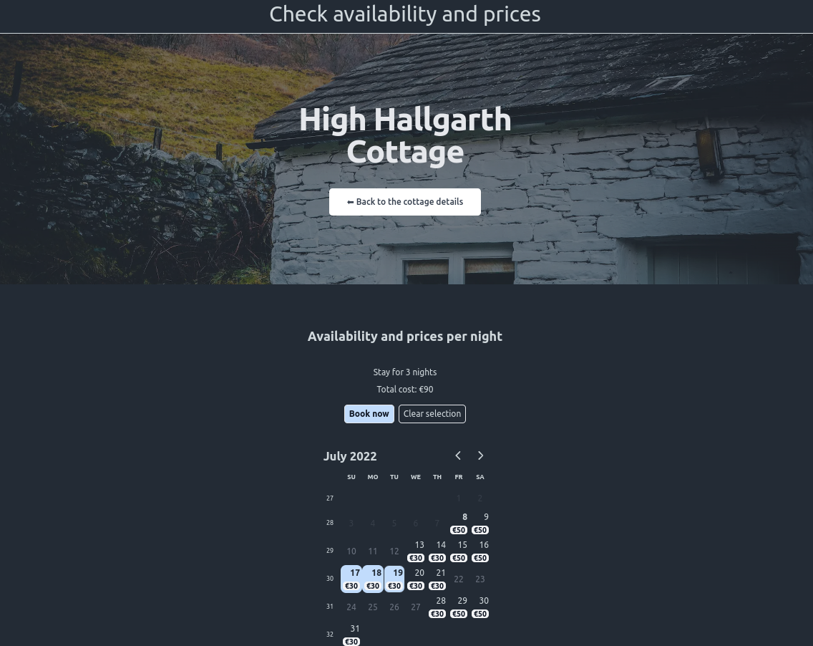

# rent-a-place

From a [tutorial](https://github.com/flaviocopes/bootcamp-2022-week-14-rental-apartment) by [Flavio Copes](https://github.com/flaviocopes)

Built in NextJS with

-   [Tailwind CSS](https://tailwindcss.com/)
-   [Prisma ORM](https://www.prisma.io/)
-   [React Day Picker](https://react-day-picker.js.org/)
-   PostgreSQL database hosted on [Railway.app](https://railway.app/)
-   email sandbox by [Mailtrap](https://mailtrap.io)
-   payments handled by [Stripe.com](https://stripe.com)

This site is not hosted online to prevent any confusion with the real thing. I built it to learn how to use calendaring and emailing from Stripe, not to spoil anyone's holiday!

## Notes about High Hallgarth

This is a real cottage that belongs to the [National Trust](https://www.nationaltrust.org.uk), which you can rent through the [High_Hallgarth](https://www.nationaltrust.org.uk/holidays/high-hallgarth-lake-district) booking website. (Unfortunately, the genuine article doesn't allow dogs)

## image credits

Stock photos from [Unsplash.com](https://unsplash.com/s/photos/cumbria?utm_source=unsplash&utm_medium=referral&utm_content=creditCopyText)

-   "1.jpg" and "5.jpg" by [Jonny_Gios](https://unsplash.com/@supergios?utm_source=unsplash&utm_medium=referral&utm_content=creditCopyText)

-   "2.jpg" by [Alice_Davies](https://unsplash.com/@daviesalice?utm_source=unsplash&utm_medium=referral&utm_content=creditCopyText)

-   "3.jpg" by [Annelie_Turner](https://unsplash.com/@ann3l13_t?utm_source=unsplash&utm_medium=referral&utm_content=creditCopyText)

-   "4.jpg" by [Chapman_Chow](https://unsplash.com/s/photos/cumbria?utm_source=unsplash&utm_medium=referral&utm_content=creditCopyText)
